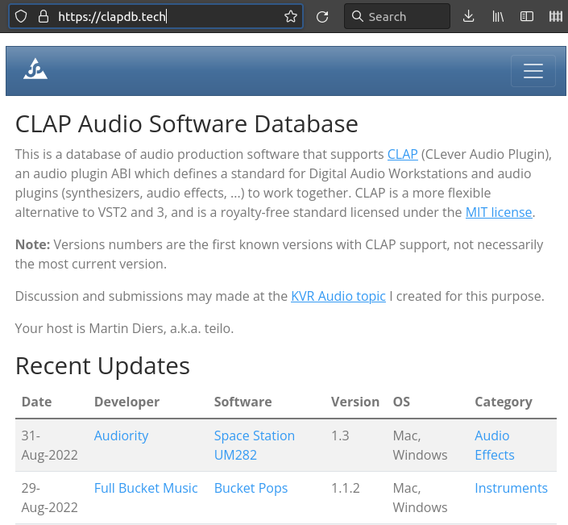
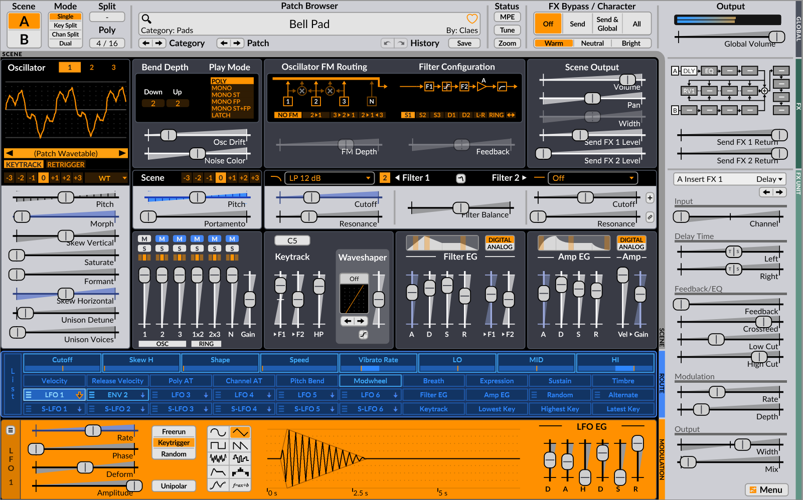

# CLAPを使う

## CLAPをサポートしているソフトウェアを発見する

ここでは、筆者が知っているCLAP対応ソフトウェア（DAWおよびプラグイン）、およびそれらを探すときのやり方をいくつか紹介します。すでに知られているものを数多く紹介することはありません。

### clapdb

2022年9月の時点では、CLAPをサポートしているソフトウェアを発見する、最も手軽な方法は、CLAP公式リポジトリからもリンクされているclapdb https://clapdb.tech/ を見ることです。

7月〜8月で合わせて30本ほどエントリーされています。

実際には、このリストは限定的で、またオープンソースではないソフトが多く、筆者はこれらについてはほぼ確認できていません。

### JUCEプラグインのCLAP対応ビルド

GitHub上に存在しているJUCEアプリケーションとしてのオーディオプラグインのいくつかが、（後述する）clap-juce-extensionsを利用してCLAP版のビルドに対応しています。以下は筆者が個別にCLAP対応を確認したプラグインのGitHubリポジトリ一覧です（2022年8月時点）。

- jatinchowdhury18/AnalogTapeModel
- Chowdhury-DSP/BYOD
-  TheWaveWarden/odin2

他にもasb2m10/dexedなどがCLAP対応ビルドのサポートを含めていますが、オートメーション対応の問題で開発継続中となっているのと、実際に試してみたらクラッシュが頻発したので、このリストには含めていません。

これらはいずれも2022年8月時点でclapdbに含まれていないものです。JUCEを利用したオーディオプラグインはこの小さなリストよりもずっと多く存在し、それらにclap-juce-extensionsをモジュールとして追加してCLAP対応ビルドを追加するのは比較的簡単なので（ただしCMakeで構成されている必要があるので、プロジェクトによってはCMakeに移行するのがより大きな課題かもしれません）、今後CLAP対応プラグインがこの領域で増加することは大いに考えられます。

### その他のプラグイン開発フレームワークのCLAP対応（待ち）

また、2022年9月になってから、LV2プラグイン開発でたまに使われているDPFでも、CLAP対応の作業が始まったようなので、今後Dragonfly-Reverbやstring-machine、ninjas2といったDPFプラグインがCLAPに移植できる可能性が出ています。

同様に、プラグイン開発フレームワークiPlug2も公式リポジトリのclapブランチでCLAPサポートの開発が進められているので、iPlug2で開発されたプラグインがCLAP対応するのも難しくはなくなるでしょう。（iPlug2を利用したプラグインはGitHubにはあまり多く存在しないので、すでに利用している開発者が試すという筋書きが中心になりそうです。）

## CLAPプラグインのセットアップ環境

一般的に、CLAPを使うためには、CLAPプラグインと、CLAPをサポートしているDAWをPCにインストールしなければなりません。DAWのセットアップについては、一般的なアプリケーションのセットアップと何ら変わることは無いので、ここではプラグインのセットアップについてのみ説明します。

CLAPプラグインは単一のバイナリファイル`*.clap`で構成されます。DAWなどのCLAPホストは、CLAPプラグインを所定のパスから検索します。CLAPヘッダーファイル`clap/entry.h`にこの記述があります。CLAPの「仕様」は独立したドキュメントとしては整備されておらず、コードコメントが仕様を説明しているということになっています。

- 環境変数CLAP_PATHで指定されたパス（Windowsでは';'、それ以外では':'で区切る）
- システムパス
  - Linux: `~/.clap:/usr/lib/clap`
  - Windows: `%CommonFilesFolder%/CLAP/;%LOCALAPPDATA%/Programs/Common/CLAP/`
  - MacOS: `/Library/Audio/Plug-Ins/CLAP:~/Library/Audio/Plug-Ins/CLAP`

環境変数CLAP_PATHは開発以外の目的で使用すべきではありません。

## CLAPをサポートするDAW

2022年8月末時点で、CLAPをサポートしているDAWには次のものがあります。なお、開発用にはよりシンプルなホストを利用できます。複雑なDAW上にデバッガーをアタッチする必要はありません。

### QTractor

QTractorはQtで作られていて、比較的シンプルな機能からなるDAWです。開発者が特にCLAP開発者コミュニティに属している様子はなく、VST3対応も比較的近い時期に行われていたため、類似の対応作業が早かったのではないかと筆者は想像します。

QTractorでプラグインのスキャンが実行されると、CLAPプラグインがリストアップされるようになります。表示するプラグインの種別をCLAPに限定するとわかりやすいでしょう。

### Bitwig Studio （4.3以降）

CLAPの開発者はBitwigの従業員であり、CLAPを全面的に推しているのがBitwigです。Bitwig Studioは、VST3にとってのCubaseのような存在です。CLAP正式版のサポートはBitwig Studio 4.3以降でのみ有効です。筆者はBitwig Studio4.2までのライセンスしか有していないので最新版での動作は確認していません。

### その他

2022年8月時点でCLAPをサポートしているのは以上ですが、CockosがReaperでCLAPをサポートしようとしているという情報がCLAPコミュニティで観測されるので、いずれReaperでもサポートが追加されるかもしれません。

## CLAPをサポートするプラグイン

DAWと比べるとプラグインの数は多いですが、CLAPをサポートするプラグインはまだまだ少なく、ほしい音源が手に入るという状況ではありません。それでもVSTやLV2と同じ音源がすでに使えるというのは比較的恵まれている状況です。

本書はCLAP音源をくまなく紹介するためのものではなく、筆者の手元でも動作が確認できたJUCE製のプラグインの、主に存在のみを紹介します（音源の特色などを詳しく語ることは本書の趣旨からは外れるので割愛します）。

### surge-synthesizer/surge

Surgeは2000年代前半からあるオープンソースのシンセサイザーで、現在でも活発に開発されています。もともとはbitwigの創業メンバーがVember Audioという屋号で有償製品として開発したものです。メイン開発者がCLAPコミュニティでもアクティブに活動しています。その特徴を言葉で説明するのは難しいので（Surgeが自称するカテゴリーも"Hybrid Synthesizer"です）、スクリーンショットと信号処理構成図を掲載するにとどめます。

### TheWaveWarden/odin2

odin2は2020年にリリースされたオープンソースのシンセサイザーで、もともとは2016年に（ソース非公開の）無償ソフトとして公開されていました。JUCE製で、LV2ビルドもサポートしていて、CLAPのサポートもclap-juce-extensionsを利用して積極的に対応したことが想像できます。公式サイトでCLAP版を同梱したWindows/Mac/Linux用のパッケージがすでに配布されているので、手っ取り早く試すことができるでしょう。これも特徴を説明するのが難しいので（公式サイトの最初の説明が "Odin 2: A Synth to Please the Gods / The sound of this 24-voice polyphonic beast will take you from your studio right to Valhalla." なので察してください）、これもスクリーンショットの紹介にとどめます。

### Chowdhury-DSP/BYOD

BYODはさまざまなコンポーネントを自由に定義してつなぎ合わせることができるギターディストーションのエフェクターです。こちらのスクリーンショットではNirvanaを選択していますが、いくつかのギタリストやバンド名のプリセットが用意されていて、セットアップ済のプリセットを簡単に選択できるので、その範囲だけでもわかりやすく使えるでしょう。

