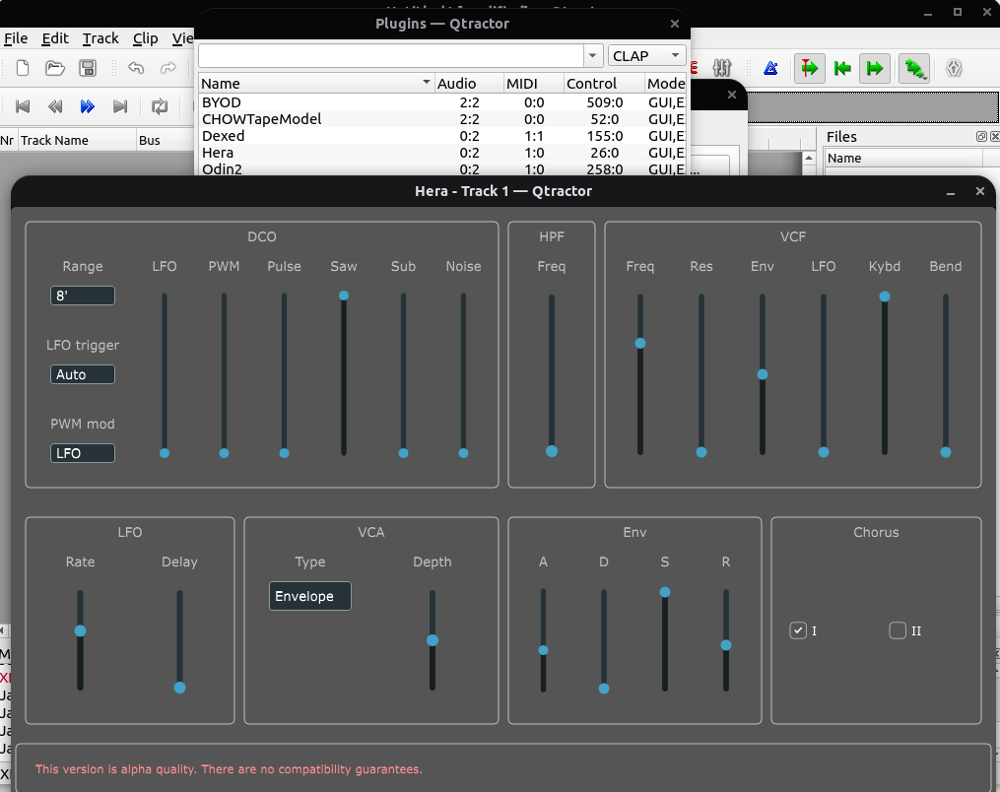

# CLAP開発ことはじめ

この章では、CLAPプラグインやCLAPホストの開発のスタートラインに立つための情報をまとめます。

## 開発環境

CLAPの開発にはCLAP APIをネイティブコードとして実装できる何らかのコンパイラツールが必要になります。CLAPのAPIはCヘッダーで定義されていますが、一般的にはclap-helpersなどを利用してC++で開発することになるでしょう。RustでCLAPプラグインを開発するclap-sysというライブラリも存在します。（筆者はRust開発の知見があるとはとてもいえないので、以降もclap-sysを用いた開発については基本的に言及しません。）

C/C++/Rust開発環境は自分の手慣れたものを使えれば十分でしょう（emacs, vim, vscode, CLion, Xcode, Visual Studioなど）。プラグインのデバッグには、プラグインのテスト用ホストを別途ビルドしてデバッグし、プラグインをロードするアプローチが有効です。

C/C++/Rust以外の言語でオーディオ処理で求められるリアルタイム処理に適性のある言語はそう多くないと思われます。筆者にはZigとGoogleが2022年に公開したCarbonくらいしか思い当たりません（Carbonはまだ実用段階ではありません）。ガベージコレクションを含む動的メモリ確保の機構があったり、実行時コード生成（これも停止時間が未知数）を伴うJITコンパイラーがあったりすると、リアルタイム要件を満足できなくなります。GoやJuliaやはこれらが理由で対象外になります。Swiftの動的メモリ確保も停止時間が未知数でアウトになる厳しい世界です。Swift forumのRealtime Threads with Swiftという議論スレッドが参考になります。

## CLAP関連のgithubリポジトリ

### free-audio/clap

CLAPのAPI仕様を定義するヘッダーファイルがここにまとまっています。ドキュメントとしての「仕様」は整備されておらず、コードコメントが仕様を説明しているということになっています。API仕様のうち拡張機能（この意義についてはCLAPプラグインの基本的な仕組みの章で説明します）のドラフト仕様は、`include/clap/ext/draft`ディレクトリに（バージョン1.0の時点では）含まれており、ここに含まれるAPIは将来破壊的に変更される可能性があります。

最新版はもはやバージョン番号が1.0.0ではないのですが、APIには破壊的変更が加えられてはいないはずです。コードコメントには説明（実質的には「仕様」）の変更がどんどん加えられています。

ちなみに、Cだけで作られたプラグインは、筆者には（本書執筆時点では）発見できませんでした。

### free-audio/clap-helpers

CLAPプラグインやホストをC++で実装するときに有用なユーティリティ機能をいろいろまとめたライブラリのリポジトリです。CLAP本体同様、header onlyのソースとなっています。たとえば、CLAP1.0仕様で規定された拡張機能をプラグイン側で実装できるスタブが用意されていて、clap-helpersを使ってプラグインを実装する場合はそれらのメンバーをオーバーライドして実装するだけで済むようになります。あるいは、ホストからプラグインに渡されたホスト情報のポインターをもとに、ホスト側の拡張機能が実装されているという前提でそれらを呼び出せるようなプロクシー（`HostProxy`）も利用可能です。

CLAPのリポジトリ（free-audio/clap）にあるヘッダーファイルは、プラグインとホストのAPIを規定するものであり、インターフェースは基本的に実装を含みませんし、どんなプラグイン・どんなホストでも必要・有用なコードであっても、インターフェースのヘッダーに含めるよりは、（このfree-audio/clap-helpersのように）実装基盤として切り離すほうが理にかなっています。（これと比べると、LV2 AtomのUtilitiesなどは、仕様の中に実装の便利機能が含まれている例で、あまり治安が良くないと評価せざるを得ません。）

### free-audio/clap-info

ローカル環境にインストールされているプラグインを列挙して、その詳細情報を表示する小型ツールです。LV2を使った経験があれば、lv2-listとlv2-infoに相当すると考えるとよいでしょう。こちらは引数なしで実行すると詳細なヘルプが表示されます。`-l`でプラグインを列挙してファイルパスを取得し、今度はそのファイルパスのみを引数に渡して詳細情報を表示するのが、典型的な使い方になるでしょう。

もしプラグインではなくプラグインホストを開発するなら、プラグインをロードしてスキャンする部分とプラグインのインスタンスを生成する部分を理解する必要がありますが、このツールのソースを追跡すれば基本的な流れがわかるでしょう。

### glowcoil/clap-sys

CLAPプラグインをRustで開発できるようにCLAP API互換のAPIを再現したライブラリです。このライブラリを使うのは実質的にCLAPのC APIでそのままプログラミングするのとあまり変わらないでしょう。もう少し構造化されたライブラリとして prokopyl/clackなどもあります（ただしAPI設計がまだ実験的であり安定していないことに注意すべきです）。

### robbert-vdh/clap-validator

CLAPプラグインが適切に実装されているかをテストできるユーティリティが含まれているRustアプリケーションです。

### free-audio/clap-plugins

CLAPプラグインの実装例が含まれています。CLAPプラグインはすでにsurgeをはじめ複数公開されているので、このリポジトリに含まれるプラグインを使いたい場面はそれほどないかもしれません。

また、GUIにQtを使用しているのは悪い実装なので、このリポジトリをCLAPプラグインの見本として使うべきではありません。この作者も（CLAP仕様の開発者なのですが）後になって「プラグインのGUIにQtを使うのは危険」とREADMEに明記しています。プラグインホスト（DAW）がGTKなどでプラグインとは別のアプリケーションループを構築していると、正常に動作しないためです。Linuxデスクトップ上で動作するプラグインでは、どのようなGUIフレームワークでも正常に動作するための最大公約数としてX11のAPIを使うことが推奨されています。JUCEやDPFはこの制約に従ってX11のAPIで実装されています。

### free-audio/clap-host

シンプルなCLAPホストの実装例が含まれています。プラグインのデバッグ用途では、これくらいシンプルなホストを使うのがよいでしょう。ドキュメントはあまり整備されておらず、基本的な使い方の説明もありませんが、コマンドラインで`-p`と`-i`の引数を使用して特定のプラグインをロードして適用する使い方になります。

`./build/host/clap-host -p (.clapファイル) -i (プラグインのインデックス)`

`-h`または`--help`で使い方が表示されます。`-?`では何も出てきませんし、引数を指定しないと何も機能しないウィンドウが表示されます。

### free-audio/clap-juce-extensions

clap-helpersを活用して作られた、JUCEプラグインをCLAP対応にするためのJUCEモジュールです。JUCE7を前提に開発されていて、CMakeLists.txtに組み込むやり方であれば簡単に利用できます。Projucerを使うプロジェクトで利用する方法もREADMEに記載されています（本書ではそこまで踏み込まないので、興味のある読者は独自に試してみてください）。

筆者はJUNO-60のエミュレーター音源であるHera (jpcima/Hera)をclap-juce-extensionsをドキュメント通りにCMakeLists.txtにパッチを当ててCLAP版をビルドできています。



## CLAPプラグイン開発を始めるアプローチ

### clap-juce-extensionsやDPFを使って開発する

CLAPプラグインの機能の大半は一般的なオーディオプラグインの機能です。オーディオプラグインは、複数のホスト（DAW）が複数のプラグインフォーマットを一様にサポートするのが一般的であり、またプラグイン開発者も特定のプラグインフォーマットでしか利用できない機能を特別に実装するメリットは薄いので、よほどCLAPの新機能を活用したい、あるいは売り込みたい動機が無い限りは、汎用オーディオプラグインSDKがサポートする範囲の機能を使ってCLAPプラグインを開発するほうが、開発の知見も流用できて楽になるはずです。

JUCEを使ってオーディオプラグインを開発した経験があれば、clap-juce-extensionsをプロジェクトのCMakeLists.txtでちょっと追加するだけでCLAP版をビルドできる可能性があります（前述の筆者のCLAP版Heraは4行のパッチで出来ました）。

DPFのCLAP対応も、筆者は自ら試したことはありませんが、DPFの開発者がdragonfly-reverbに適用したCLAP対応に必要な変更を見ると、ひとつのプラグインにつき、`Makefile`の`TARGETS`に`clap`を追加して、`#define DISTRHO_PLUGIN_CLAP_FEATURES "audio-effect", "reverb", "stereo"`のような定義を1行追加して、追加でプラグインIDを`DISTRHO_PLUGIN_CLAP_ID`として別途定義するだけで対応できているようです。

このアプローチであれば、CLAPプラグインの開発方法を勉強するというのは、実質的に「JUCEでのプラグインの開発方法を勉強する」とか「DPFでのプラグインの開発方法を勉強する」というのとほぼ変わらず、CLAP独自のやり方を学ぶ必要は無いということになります。ビルドしたCLAPプラグインは`*.clap`という独特な拡張子なので、ソースツリーで`find . -name *.clap`などを実行すればすぐに発見できるでしょう。

### フルスクラッチで始める場合

汎用オーディオプラグインSDKの類を使うのは性に合わない、可能な限り依存性を排除してCLAPのSDKだけでフルスクラッチで開発したい、という場合、プラグイン開発は次のような`clap_entry`を定義するC/C++プログラムを作るところから始めることになるでしょう。

```
#include "clap/clap.h"

const  clap_plugin_entry_t  clap_entry = { ... }
```

`clap_plugin_entry_t`はCLAPヘッダーファイル`clap/entry.h`に定義されています（それ以上の情報は読者がIDE等で定義を追及していってください）。clap-helpersを使ってC++でプラグインを定義する場合、このCのエントリーポイントのAPIとつなぎ合わせる部分は、free-audio/clap-pluginsのソースツリーに含まれる`plugins/clap-entry.cc`というソースファイルが参考になります。この`clap_entry`がDAWによってロードされる仕組みについては、次章で説明します。


