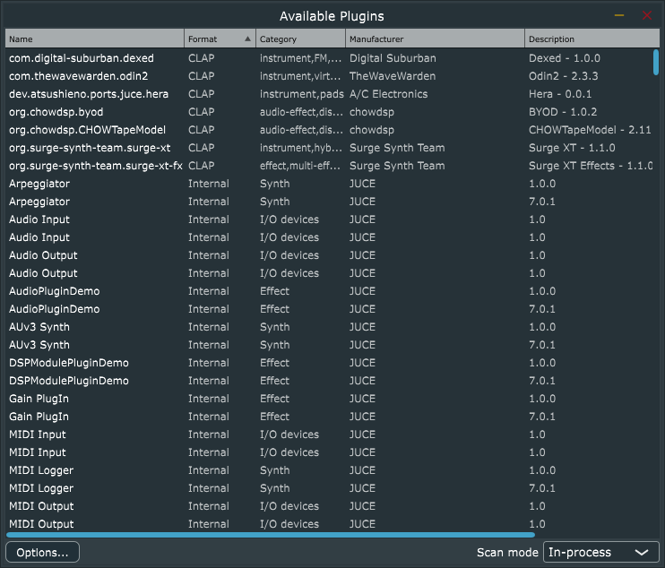

# CLAPのコア部分の仕組み

## オーディオプラグインの一般的な仕組み

### 概要

CLAPは汎用オーディオプラグインフォーマットです。汎用オーディオプラグインフォーマットは、任意のDAWで任意のプラグインを利用できるようにするために作られる規格です。オーディオプラグインは、プラグインフォーマットが規定するAPIを実装し、DAWは、プラグインフォーマットが規定するAPIの実装コードをバイナリプログラム（DLLなど）からロードします。

2022年の本書執筆時点では、オーディオプラグインフォーマットは複数の規格が並立していますが、基本的な機能は大まかには次の通りで、大きく違うものではありません。

- 動的ライブラリに類するかたちでロードでき、複数のインスタンスを生成できる
- ステレオ等のオーディオ入力とMIDI等のコントロール入力を「オーディオ処理」のサイクルで受け取って、オーディオ出力およびコントロール出力に変換する
- 外部から操作でき、変更をGUIに通知できるfloatのパラメーターがある（その他の型をサポートすることもある）
- MIDIなどの「イベント」を受け取ったり通知したりできる（オーディオ処理と連動するかしないかは規格による）
- プラグインのパラメーター等を状態として保存・復元できる
- メタデータとしてプラグイン名やベンダー名をもち、プラグインホスト（DAWなど）がシステム上に有るプラグインをリストアップできる
- ホストDAWからサブウィンドウに表示できるGUIをもつ

これらだけであれば、素朴に設計するのも実装するのもそんなに難しくはありません。特にプラグインフォーマットとはAPIであって実装コードである必要はないので、宣言してしまえば大部分の仕事は終わりです。free-audio/clapのリポジトリの内容も、ほぼAPIのみなのでシンプルです。

もちろん、適当にAPIを作っただけではプラグインでもDAWでも対応してもらえないので、実際にプラグインフォーマットを定着させるためには、それ以上の仕事をすることになります。魅力的な追加機能を用意したり、それらが多数になっても一貫性を保てたり、簡単に実装できたり…といった設計の調整力が必要になります。CLAPはここに小さからぬ労力を割いており、CLAPの長所が出ている側面でもあります。

## CLAPプラグインのスキャンとロード

DAWユーザーがオーディオプラグインを使うとき、最初にローカル環境にインストールされているプラグインのリストを取得する必要があるのが一般的です。リストには次のスクリーンショットのような内容が含まれます。



これはJUCEのAudioPluginHostというプログラムに筆者が手を加えてCLAPプラグインも列挙できるようにしたもので、実用性はありません（プラグインを正しくロードできません）が、DAWを利用したことのある読者は、このようなリストをセットアップした経験があるでしょう。

第2章で説明したとおり、プラットフォームごとにCLAPプラグインを検索するパスが決められているので、その中から拡張子が`.clap`であるものを、`dlopen()`や`LoadLibrary()`などプラットフォーム別のやり方で動的ライブラリとしてロードしていきます。ひとつの`.clap`ファイルには複数のプラグインが含まれていることがあります。

### プラグインのロードとインスタンス生成

ホストを開発するとき、プラグインのライブラリをロードした後のプラグインインスタンス生成については、`include/clap/entry.h`のコードコメントを参照すると良いでしょう。このヘッダーファイルには、プラグインのエントリーポイントとなる`clap_entry`の宣言が含まれています。この宣言通りの変数を、自分のプラグインのライブラリで定義すれば、それがホストからロードされることになります。ロードしたら`init()`、正常終了時にアンロードする前には`deinit()`を呼ぶ必要があります。

実際のプラグインインスタンスの生成は`get_factory(CLAP_PLUGIN_FACTORY_ID)`という`clap_entry`のメンバー呼び出しで`clap_plugin_factory_t`型の変数を返させてから行います。この型と`CLAP_PLUGIN_FACTORY_ID`という定数は`entry.h`ではなく`plugin-factory.h`という別のヘッダーファイルで定義されています。

#### 高度な話題: 高速なプラグインのロード

CLAPは公式発表ではfast scanningをサポートしていると公言しているのですが、CLAPのメタデータは実のところライブラリに格納されていてDLL等をロードしないと取得できず、この点ではLV2に劣ります。さらに、VST 3.7.5もLV2のようにプラグインのメタデータを`moduleinfo.json`というファイルに出力できるようになったので、最新のVST3の仕組みよりも遅いことになってしまいました（とはいえ、VST3プラグインもホストも最新仕様に追従するまではしばらくかかるでしょう）。プラグインのfactoryのインスタンスさえ取得すればメタデータを取得できるので、プラグイン本体のインスタンスを生成しなくても済む、という点においてのみVSTより高速だといえることになります。DLLをロードすると全てのstaticデータの初期化が発生するため、JUCEのBinaryData初期化などでDLLのmmapロード以上のコストがかかるということもありますし、プラグインによってはこのDLLロードとメタデータ取得の時点でライセンスアクティベーションダイアログを出してくるものがあり、これらが迅速なプラグインリストの生成を邪魔してくるわけです。DLLをロードする方式だとそういった問題があるため、JSON等でメタデータを生成して解析できるようにしたほうが良い、というコミュニティ（筆者も含む）からはフィードバックが出ているのですが、開発チームは「JSONを解析しないといけなくなるから嫌だ」というレベルで否定的な見解を示しており、改善が施されるかは不透明なところです。

ちなみに、プラグインの列挙が仕組み上高速に完了するとしても、プラグインリストをキャッシュするDAWの仕組みがなくなるというとは限りません。プラグインリストキャッシュには「ロードに失敗した」プラグインをリストから除外する、いわゆるallowlist/denylistを管理することも期待されるためです。

また、筆者がJUCEのホスティングAPIの応用としてCLAPプラグインのホスティングを実装しようとしたところ、JUCEのプラグインメタデータを表す`PluginDescription`クラスには`numInputChannels`、`numOutputChannels`などのポート情報が含まれており、これらはCLAPプラグインでもインスタンスを生成しないと取得できない情報なので、結局プラグインのインスタンス生成を行わなければならず、高速なプラグインのスキャンは実現できませんでした（ポート情報は取得できないということにも出来なくはないですが、JUCEのAudioPluginHostのようなアプリケーションでCLAPプラグインノードを生成したときにポート情報が正しく反映されない可能性があります）。

### プラグインメタデータの定義とプラグインファクトリー

プラグインを開発するときは、ここまで説明してきたのとは「逆の」実装が必要になります。`get_factory()`関数を自分で定義し、`clap_plugin_factory_t`型の変数を返さなければなりません。この型の変数を返すためには、次の一連の関数を関数ポインターメンバーとして指定する構造体を定義しなければなりません。

- そのプラグインライブラリに含まれるプラグインの数を`get_plugin_count()`で返す
- `get_plugin_descriptor()`という関数で、指定されたプラグインのメタデータを`clap_plugin_descriptor_t`型の変数で返す
- `create_plugin()`でプラグインのインスタンスを`clap_plugin_t`型で返す

2番目の`get_plugin_descriptor()`が返す`clap_plugin_descriptor_t`には、プラグインのさまざまなメタデータが含まれることになります。ID、名前、ベンダー名、バージョン番号など典型的な情報が多いです。詳しくは`include/clap/plugin.h`に含まれている`clap_plugin_descriptor_t`の定義を参照してください。

そして、`get_factory()`などのメンバーを含む`clap_plugin_entry`型の変数`clap_entry`をグローバル変数として定義して、他のプログラムが`dlopen()`などでこのCLAPプラグイン（`*.clap`）をロードした時に参照できるシンボルとしてエクスポートする必要があります（一般的にはCLAPライブラリのビルドが最終工程になって`clap_entry`シンボルがhidden扱いで隠蔽されるようなことは無いので、エクスポートのために特別にビルド設定を調整することは無いでしょう）。

## CLAPの拡張機構

続いてオーディオ処理の説明に入りたいところですが、CLAPではオーディオ処理に必要不可欠なデータ構造が拡張機構に依存する珍しい規格なので、先に拡張機構について説明します。

オーディオプラグインの拡張性 (extensibility) とは、シンプルにいえば機能追加のための仕組みです。プラグイン規格に追加機能を持ち込むには、APIを拡張しなければなりません。これを無計画に行うと、後から「やっぱりこの機能はいらなかった」とか「やっぱりこのAPIだとイマイチだから仕切り直そう」と思っても、後方互換性を全面的に破壊することになってしまいます。つまり、古いプラグインのコードが新しいプラグイン規格SDKのバージョンでビルドできなくなったりします。

VST2がこの無計画なスタイルで開発されてきましたが（20世紀に作られた仕様であり、誰もがAPIの後方互換性を強く意識するような時代ではありませんでした）、VST3ではこれが大きく変わりました。VST3ではコア機能と拡張機能を切り分けて、拡張機能はWindowsのCOM技術におけるクエリインターフェースの仕組みで動的に取得するようになりました。もし拡張機能の一部でAPIの進化が行き詰まったとしても、それ以外の部分は後方互換のままで利用できることになります。これはVST-MA (module architecture) と呼ばれる仕組みです。

よくVST3はVST2と比べて複雑だと言われますが、この拡張性に関する設計方針は、フレームワーク開発者の間では広く受け入れられていて、LV2でもCLAPでも同様の機構をCで実現しています。オーディオプラグイン規格以外でも、OpenSLなどにも見られます。

何をもってコア機能とし、何をもって拡張機能とするかは、これらモダンなプラグインフォーマットの間でも違いがあります。CLAPはだいぶ強めに「拡張機能化」を実現していて、オーディオポートやノートイベント・パラメーターイベント用ポートの定義すらも全て拡張機能で実現しています。

### CLAP拡張機能へのアクセス

CLAPでは、拡張機能がクリーンに整備されています。CLAPの拡張機能にはプラグイン拡張とホスト拡張がありますが、全てのプラグイン拡張機能が`clap_plugin_*_t`として定義されており、同様に全てのホスト拡張機能が`clap_host_*_t`として定義されています。プラグイン拡張のAPIは「プラグインが実装し、ホストが呼び出す」ものであり、ホスト拡張の機能は「ホストが実装し、プラグインが呼び出すもの」と理解しておけばOKです。

| 拡張の種類 | 実装者 | 利用者 |
|-|-|-|
|プラグイン拡張|プラグイン|ホスト|
|ホスト拡張|ホスト|プラグイン|

プラグインが実装する拡張は、`clap_plugin_factory_t`の`create_plugin()`で返される`clap_plugin_t`の`get_extension()`メンバー（関数ポインター）の実装となる関数で、IDに対応するものを返すかたちで実装します。たとえばプラグインでstateを保存する機能（パラメーターが存在するプラグインではほぼ実装することになるでしょう）を実装する場合はこうです。

```
clap_plugin_state_t state_ext{my_plugin_state_save, my_plugin_state_load}; // それぞれ関数
void* my_plugin_get_extension(const clap_plugin_t* plugin, const char* id) {
    if (!strcmp(id, CLAP_EXT_STATE))
        return &state_ext;
    ...
    return nullptr;
}
```

プラグインがホスト拡張を呼び出す方法については少し追加説明が必要でしょう。これに関連してはまず、拡張ではありませんが、CLAPのplugin factoryとなる`clap_plugin_factory_t`の`create_plugin()`の定義について説明します。

```
const clap_plugin_t *(*create_plugin)(const struct clap_plugin_factory *factory,
  const clap_host_t *host,  
  const char *plugin_id);
```

この2番目の引数は`clap_host_t*`という型になるのですが、これはホスト実装のポインターである必要はなく、プラグインが必要とするホスト機能を提供する実装でさえあれば十分です。`clap_host_t`には次のようなメンバーがあります（コメントを削っています）:

```
typedef struct clap_host {
   clap_version_t clap_version;
   void *host_data;
   const char *name;
   const char *vendor;
   const char *url;
   const char *version;
   const void *(*get_extension)(const struct clap_host *host, const char *extension_id);
   void (*request_restart)(const struct clap_host *host);
   void (*request_process)(const struct clap_host *host);
   void (*request_callback)(const struct clap_host *host);
} clap_host_t;
```

ホストのメタ情報のほか、ホスト拡張機能を取得するための`get_extension()`、ホストのmain (UI)スレッドで処理を呼び出すための`request_callback()`、オーディオ処理を開始させるための`request_process()`や`request_restart()`などが定義されています。ホスト拡張機能はこの`get_extension()`で取得して使います。

## CLAPプラグインのオーディオ処理

### オーディオ処理部分の基本形

オーディオプラグイン規格は、それぞれ互換性が無いものですが、楽器やエフェクターとしての基本的なオーディオ処理の部分には共通の部分が多いです。以下に擬似コードで列挙します。

- `create()`: プラグインを生成する
- `activate()`: プラグインを有効化し、一般的にはリアルタイム処理モードに移る
- `process(audio_buffers, midi_buffers)`: オーディオ入力とMIDI入力を受け取って出力を生成する
- `deactivate()`: プラグインを無効化し、一般的にはリアルタイム処理モードを脱ける
- `destroy()`: プラグインを破棄する

「MIDI入力」と書いている部分は、実際にはMIDIではなくプラグイン規格ごとに異なりますが、これについては次の節でじっくり説明します。ここではオーディオ入力について掘り下げます。

### `clap_plugin_t`: プラグインの実装

CLAPプラグイン開発者は、自分のプラグインを`clap_plugin_t`という型で定義することになります。これを`clap_plugin_factory_t`の`create_plugin()`で返すことで、プラグインのロードからの一連の流れが完成します。

`clap_plugin_t`は次のような内容になっています。このメンバー全てを説明すると長くなりすぎてしまうので割愛しますが、先の疑似コードと似たようなメンバーが含まれていることだけ確認してください。

```
typedef struct clap_plugin {
   const clap_plugin_descriptor_t *desc;
   void *plugin_data;
   bool (*init)(const struct clap_plugin *plugin);
   void (*destroy)(const struct clap_plugin *plugin);
   bool (*activate)(const struct clap_plugin *plugin,
                    double                    sample_rate,
                    uint32_t                  min_frames_count,
                    uint32_t                  max_frames_count);
   void (*deactivate)(const struct clap_plugin *plugin);
   bool (*start_processing)(const struct clap_plugin *plugin);
   void (*stop_processing)(const struct clap_plugin *plugin);
   void (*reset)(const struct clap_plugin *plugin);
   clap_process_status (*process)(
       const struct clap_plugin *plugin, const clap_process_t *process);
   const void *(*get_extension)(
       const struct clap_plugin *plugin, const char *id);
   void (*on_main_thread)(const struct clap_plugin *plugin);
} clap_plugin_t;
```

### オーディオデータとバス、ポート、チャンネル

「オーディオデータ」に渡ってくるのは、「全オーディオチャンネル」分のfloatあるいはdoubleの配列です。最近はdoubleを使う状況もありますが、一般的にはfloatが使われるでしょう。「全オーディオチャンネル」とは、1つ以上の「オーディオバス」ごとに割り当てられた「チャンネル数」です。オーディオバスは少しややこしい概念で、難しければ飛ばしても何とかなる概念です（飛ばした場合は「ステレオ」になると考えれば良いです）。もう少しちゃんと説明すると、オーディオバスとはチャンネルの構成に名前と特性がいくつか付いた構造です。具体的なものを挙げたほうがわかりやすいでしょう。

- mono
- stereo
- 5.1ch
- 7.1ch
- ambisonic

これらの名前は暗黙的に「メイン入出力」を含意していることが多いです。これらはそれぞれ固有のチャンネルを有しており、一般的にはチャンネルにも名前が付いています（"L", "R", "front left", "rear back right" など)

「メイン」があるということは補助的なものもある…というわけで、オーディオプラグインには「サイドチェイン」として直接再生するわけではなく波形の計算に補助的に利用するオーディオデータを渡すこともできます。LV2ではCVPortがサイドチェインを実現するためのものです。

ホストDAWは、各トラックについて、オーディオプラグインに「利用できるオーディオバスの情報」を提示してもらい、トラックで利用できるバスを調整し、バスのオーディオバッファを準備します。メインのバスは一般的には1つになりますが、補助的にサイドチェインのバスが複数有効化される可能性があります。そして実際にオーディオ処理`process()`を呼び出すとき、有効なオーディオバス全てに関連付けられたオーディオチャンネル分のバッファが、引数として渡されることになります。

VSTの場合はバスと呼ばれますが、CLAPではポートと呼ばれています。LV2でもポートと呼ばれるのですが、これはバスに相当する概念ではなくチャンネルに相当する概念なので（つまり「ステレオ」ポートにはならず「左」ポートと「右」ポートになる）、混乱しないように区別して捉えておかなければなりません。

CLAPでは`audio_ports`拡張機能を使用してポートの詳細情報を取得します。この拡張機能の構造体は次のように定義されています。

```
typedef struct clap_plugin_audio_ports {
   // [main-thread]
   uint32_t (*count)(const clap_plugin_t *plugin, bool is_input);
   // [main-thread]
   bool (*get)(const clap_plugin_t    *plugin,
               uint32_t                index,
               bool                    is_input,
               clap_audio_port_info_t *info);
} clap_plugin_audio_ports_t;
```

`count()`関数でポートの数が返され、`get()`で`clap_audio_port_info_t`という詳細情報の構造体が返されます。これにはそれなりの量の項目が含まれるので詳しくは割愛しますが、識別子`id`とチャンネル数`channel_count`が含まれるので、ホストはこの情報をもとに、実際のオーディオ処理で、有効なポートのチャンネルの数だけオーディオデータのバッファをプラグインに渡して処理させることになります。詳しくは`process()`の項で説明します。

### オーディオプラグインにおけるMIDIサポートの基本

CLAP開発チームがよく宣伝している機能のひとつが高度なノート命令ですが、これを理解するためには、そもそもオーディオプラグインはどうやってMIDI命令を処理しているのか、理解しておく必要があるでしょう。

実のところ、オーディオプラグインでなまのMIDIメッセージをそのまま処理することはあまりありません。オーディオプラグインフォーマットごとにMIDIより高度な（データ幅や追加情報が多い）ノートイベントやコントロールチェンジイベントなどが規定されていて、MIDI入力はDAWによって変換されてプラグインに渡されるのが一般的です。プラグインを開発できるSDKによっては、受け取ったイベントメッセージをMIDIメッセージに（DAWとは逆の方向に）変換して、VSTやAUやLV2の共通コードとして実装できるようにすることも多いです（JUCEなど）。

オーディオプラグインがMIDIのようなイベントを受け取る入口は主に2つあります:

- イベントとして受信する: DAWでPCに接続されたMIDIキーボードの鍵盤を押すと今のトラックのオーディオプラグイン設定で非リアルタイムに演奏されます（発音します）
- 演奏命令として受け取る: DAWに打ち込んだ内容を再生するとき、DAWは対象の全トラックでリアルタイムオーディオスレッドを用いて「オーディオループ処理」を回します。1回の処理はリアルタイムと言える間隔（10ミリ秒程度）の間に全て完了しなければなりません。そうしないと不自然な「空き」が生じてしまい、遅延やノイズの原因になります。このループの中に、演奏命令としてイベント列も含まれることになります。

ここで一つ気をつけないといけないのは、オーディオループはリアルタイムスレッドで回っていて、一方でMIDIキーボード等の入力はI/Oを伴う非リアルタイムスレッドから受け取るということです。リアルタイムでオーディオ処理を回しているときに、ちょっとだけ時間を借りてMIDI入力に対応する音声を生成して戻ってくる…ということはできません。

実際にDAWを使っているときは、トラックを再生しながら同時にMIDIキーボードを叩いていることがあり、この意味では受信した入力イベントは演奏命令にマージされると考えて良いでしょう。ただしそのタイミングは1回のオーディオループで処理される実際の演奏時間の長さによって変わります。もし仮に1回のオーディオループで1000ミリ秒分のオーディオデータが処理されるとしたら、オーディオループは1秒に1回しか回りません。その間のどのタイミングでMIDIキーボードの鍵盤が押されたとしても、ノートイベントが発生するのはその1秒単位のスライスの始点でのみということになります。

### DSPコードの共通化

VSTもAUもCLAPもそれぞれバラバラなパラメーターとイベントの機構をもっていますが、VSTでもAUでもLV2など他のフォーマットでもプラグインをリリースしたいと思ったら、それぞれのフォーマットに固有のDSP処理を書くよりも、MIDIのような共通の音楽演奏命令のデータを使って記述するようにしたほうが、再利用性が高いです。

DSPでコードを共通化できるということになったら、JUCEのようなクロスプラットフォーム・マルチプラグインフォーマット用フレームワークのほか、FAUSTやSOUL（SOULの権利はROLI社に残ってしまったので創始者のjulesは今は新しくc-majorという言語を作っているようですが）といったオーディオ処理に特化した言語、あるいはMATLABのような言語環境も適用できる可能性が高くなります。

例として、オーディオプラグインフォーマットのようなものが登場すると、MDAという定番DSPモジュールの集合体がmda-vst, mda-vst3, mda-lv2といった感じで移植されますが、このオリジナルのMDAのコードは汎用的なDSPコードとして書かれています。各プラグインフォーマットのプロジェクトは、それぞれのプラグインのAPIを使った「ラッパー」となっているわけです。

この領域で新しく開発されているのが、MIDI 2.0サポートの追加です。共通コードでMIDI 1.0の表現力しか得られないのは残念な状態だったわけですが、MIDI 2.0が利用できるようになれば、note expressionや32ビットパラメーター（CCやNRPN = Assignable Controller）、アーティキュレーションなどを処理できるようになります。CLAPでは、規格のレベルでMIDI 2.0メッセージをそのまま（VST3とは異なり、そのまま）処理できるようになっています。

### 各プラグインフォーマットにおけるイベント定義

VST2の時代は、MIDI入力はそのままのかたちでプラグインが受け取って処理できるようになっていました。一方でプログラムチェンジとパラメーターも利用できるようになっていたので、ある意味役割がかぶっていた状態でした。

Steinbergはこれを問題だと考えて、VST3ではMIDI入力をパラメーターとしてプラグイン側でマッピングして処理させることにしました。その結果、VST3ではなまのMIDIメッセージを受け取ることができなくなりました。これはそれなりに大きな副作用があり、まずVST3プラグインでどんなDAWでも一意に復元できるようなMIDI出力が出せなくなりました（全てVSTイベントとして出力されるため）。そしてJUCEのようにVST3イベントをMIDIメッセージに変換したうえでオーディオ処理に渡す仕組みがあって、かつプログラム番号もMIDIのプログラムチェンジとならずにそのまま渡される仕組みになっていると、DAWにはMIDIのプログラムチェンジを入力したはずなのに、プラグイン側にはプログラムチェンジとして渡されない…といった問題もありました。JUCEのように「プラグイン側ではホストからのイベントは全てMIDIメッセージに変換してその範囲で処理する」仕組みになっていると、この影響をストレートに受けることになります。

CLAPは、VST3とは異なり、MIDI 1.0イベント、MIDI 2.0イベント、CLAPイベントの3種類がサポートされており、DAWはどの入力もそのままプラグインに渡せば良いということになります。

VST3は「役割が重複したら困るだろうからホストが全部われわれのVSTイベントに変換するのでそれを使え」という姿勢ですが、CLAPの場合は「複数の入力イベントの種類で役割が重複するかもしれないが、その解決方法は自分でやれ」ということになります。言い換えると、CLAPの場合、CLAPイベントとMIDIイベントが排他的かどうかは明記されていません。これに比べると、MIDI 2.0 UMP仕様では、「MIDI 1.0プロトコルで処理可能なUMP」と「MIDI 2.0プロトコルで処理可能なUMP」が明確に規定されています。たとえば、MIDI 2.0プロトコルでMIDI 1.0チャンネルボイスメッセージを送ることは許されません。

### CLAPのprocess関数

この節の冒頭で、オーディオプラグインの一般的な処理フロー（create, activate, process, deactivate, destroy）について説明しましたが、CLAPプラグインでは、`clap_plugin_t`にこれらの一部が含まれています。`process()`関数については特に`clap_process_t`という複雑な引数構造体を持っているので、説明が必要になるでしょう。この構造体は`include/clap/process.h`に定義されていますが、ここではコードリストに一部のメンバーのみを抜粋して示します。

```
typedef struct clap_process {
   ...
   uint32_t frames_count;
   ...
   const clap_audio_buffer_t *audio_inputs;
   clap_audio_buffer_t       *audio_outputs;
   uint32_t                   audio_inputs_count;
   uint32_t                   audio_outputs_count;
   const clap_input_events_t  *in_events;
   const clap_output_events_t *out_events;
} clap_process_t;
```

処理対象フレーム数（オーディオバッファの長さ）、オーディオ入力と出力、MIDI等のイベント入力と出力が含まれています。実際にはさらに演奏中の楽曲の詳細情報なども取得する窓口があるのですが、今は省略します（`clap_event_transport_t`、大まかにはVST3の`ProcessContext`に相当します）。

### CLAPオーディオバッファ

オーディオバッファ`clap_audio_buffer_t`の定義は別のヘッダーファイル`include/clap/audio-buffer.h`に、イベントバッファ`clap_input_events_t`と`clap_output_events_t`も別のヘッダーファイル`include/clap/events.h`に定義されています。

オーディオバッファ構造体の定義は難しくありません。

```
typedef struct clap_audio_buffer {
   // Either data32 or data64 pointer will be set.
   float  **data32;
   double **data64;
   uint32_t channel_count;
   uint32_t latency;       // latency from/to the audio interface
   uint64_t constant_mask;
} clap_audio_buffer_t;
```

32bit floatと64bit doubleで別々のフィールドを持たせられるようになっているのがひとつの特徴です。もうひとつ特徴的なのはlatencyのフィールドをこの構造体のレベルで指定できるところで、つまりオーディオデバイスごとに生じている遅延を反映できるようになっています。

### CLAPイベントバッファ

イベントバッファ構造体は少し詳しく説明する必要があります。入力イベントリスト構造体`clap_input_events_t`は次のように定義されています。

```
typedef struct clap_input_events {
   void *ctx;
   uint32_t (*size)(const struct clap_input_events *list);
   const clap_event_header_t *(*get)(const struct clap_input_events *list, uint32_t index);
} clap_input_events_t;
```

コンテキスト情報`ctx`はこの構造体を生成するホスト側が任意に使います。`size()`はリストのサイズを返し、`get()`は個別のメッセージを返します。sizeが実際に何を示すのか、バイト数なのか入力イベントの「数」なのか、CLAP仕様は曖昧です（これは仕様に問題がありますが、すでにGitHub Issuesにバグ登録してあるので、いずれかに解決されると期待して話を進めましょう）。`get()`では、指定されたindexにある個別のイベント構造体の可変長データのポインターが返されます。

出力イベントリスト構造体`clap_output_events_t`構造体はもう少し簡単です。`try_push()`でイベントリストとイベントを引数に渡すと、リストにイベントを追加できます（ただしメモリ不足で失敗することもあるので、失敗時にはfalseを返すというかたちになります。

```
typedef struct clap_output_events {
   void *ctx;
   bool (*try_push)(const struct clap_output_events *list, const clap_event_header_t *event);
} clap_output_events_t;
```

### CLAPイベントデータの基本構造

個別のイベントデータの構造について、さらに掘り下げて説明する必要があるでしょう。イベントは、`include/clap/events.h`に含まれるものだけでも次の8種類があります。

- `clap_event_note_t`
- `clap_event_note_expression_t`
- `clap_event_param_value_t`
- `clap_event_param_mod_t`
- `clap_event_param_gesture_t`
- `clap_event_transport_t`
- `clap_event_midi_t`
- `clap_event_midi2_t`

これらのイベントはCLAPコアイベントと呼ばれ、`CLAP_CORE_EVENT_SPACE_ID`という名前空間のようなIDで識別されます。独自の"space ID"を定義すれば、プラグインあるいはホスト独自のイベント定義を使うことも可能です。ただし、その構造を解析できるよう、最低限のルールに準拠する必要があります。

これを説明するために、まずCLAP固有の情報が少ないMIDIイベントの構造体`clap_event_midi_t`を例に説明しましょう。

```
typedef struct clap_event_midi {
   clap_event_header_t header;
   uint16_t port_index;
   uint8_t  data[3];
} clap_event_midi_t;
```

3バイトのメッセージデータが入っていて、システムエクスクルーシブ以外のメッセージを送れる典型的なMIDIイベントです。`clap_event_header_t`はどのイベント構造体でも使われる重要な部分で、この`header`フィールドが必ず先頭に入っています。定義内容は次のとおりです。

```
typedef struct clap_event_header {
   uint32_t size;
   uint32_t time;
   uint16_t space_id;
   uint16_t type;     // event type
   uint32_t flags;    // see clap_event_flags
} clap_event_header_t;
```

- `size`はこのヘッダー自身も含むメッセージのバイト数が含まれます。
- `time`はそのイベントが処理されるべきタイムスタンプをオーディオ処理におけるサンプル数で指定します。たとえばオーディオサンプルレートが44100Hzで処理されているとき、441であればその1回の処理サイクルにおける1/100秒の位置にそのイベントがあるということになります。
- `space_id`は前述の`CLAP_CORE_EVENT_SPACE_ID`などが指定されます。標準外のイベントであれば、ここに独自の値を設定します。そのようなイベントが処理されるかどうかはホスト次第、プラグイン次第です。
- `type`に何を指定するかはイベント種別次第ですが、CLAPコアイベントなら`CLAP_EVENT_NOTE_ON`などの定義済みシンボルを指定します。

`clap_input_events_t`の`get()`で返されるポインターの最初の4バイトは常に`size`の値になるので、このバイト数だけ飛ばせば次のメッセージのポインターを格納できることになります。実際にそのように詰め込まれた構造体になるかは`clap_input_events_t`の実装次第なので、データが連続していることを期待してはいけないでしょう。しかし、こういうAPI構成によって、`clap_in_events_t`は、そのデータリストの実体を単一のメモリ領域として確保しておけばよく、オーディオ処理中に動的にメモリを確保する必要がなくなります。ちなみに、このようなデータ構造はLV2のイベントシーケンスを規定するLV2 Atomとほぼ同様です。

#### clap_event_flags

`clap_event_header_t`の最後のフィールド`flags`については、もう少し細かい説明が必要でしょう。ここに指定可能な値は`clap_event_flags`というenumで定義されています。

```
enum clap_event_flags {
   CLAP_EVENT_IS_LIVE = 1 << 0,
   CLAP_EVENT_DONT_RECORD = 1 << 1,
};
```

`CLAP_EVENT_IS_LIVE`のビットが有効になっていたら、それはユーザーがGUIなどで操作した入力値であることを示します。それ以外は楽曲のシーケンスに含まれていたり、オートメーションで自動生成されていたりすることになります。`CLAP_EVENT_DONT_RECORD`は、データ入力として記録（譜面に入力）する必要のないイベントであることを示します。これもオートメーションが例になりますが、自動生成イベントなどが複数同時に走っていると、それらが記録された時に意図しないコンフリクトが生じてしまうので、それを回避するために用いられます。

### CLAPノートイベント: オン、オフ、チョーク、終了通知

CLAPが仕様として推奨するイベントは、（MIDI1/MIDI2ではなく）`clap_event_note_t`構造体で表されるもので、具体的には次の4つがあります。

- `CLAP_EVENT_NOTE_ON`
- `CLAP_EVENT_NOTE_OFF`
- `CLAP_EVENT_NOTE_CHOKE`
- `CLAP_EVENT_NOTE_END`

ノートオン、ノートオフは一般的なMIDI命令と同様ですが、`CLAP_EVENT_NOTE_CHOKE`と`CLAP_EVENT_NOTE_END`は説明が必要でしょう。まずチョークは基本的にはノートオフと同じ機能を実現するものですが、一般的にノートオフはその時点で直ちに消音するのではなくエンベロープにおけるノートリリース処理を開始し、すなわち（一般的には）短い時間ながらも段階的に音量を下げていくのに対して、チョークの場合は直ちに消音します。これは特にドラムのクローズドハイハットとオープンハイハットが排他的に発音する構造になっている場合に有用である、と説明されています。

チョークのもうひとつの利用例として仕様（コメント）に記述されているのは、MIDIシステムメッセージに含まれるall notes offのような消音の命令です。これも音をリリース無しでただちに遮断したいときに使うものなので、chokeが適切でしょう。

もっとも、実際にチョークを楽曲のデータとしてどのように打ち込むべきなのかは、ホストの設計次第であり、この命令を使って（この命令に反応して）チョークを実装するのが適切なのか、筆者は懐疑的です。VSTなどですでにドラム系プラグインがハイハットをリアルに再現できているということは、このようなイベント種別が無くてもMIDI打ち込みだけで実現できているということを示しています。MIDIイベントをサポートするプラグインでは、ノートオンとノートオフだけでこれが再現できなければならないはずです。序文で書いた問題意識と繋がる話ですが、MIDIメッセージであればCLAPから他のプラグインフォーマットに切り換えても一貫した処理を維持できるでしょうし、CLAPイベントに特化した打ち込みになっていると、一貫性が維持できません。CLAPの特長を押し出したいというプラグイン開発者のエゴによって作曲者・ユーザーが不利益を被ることになってはならない、というのが筆者の持論です。

最後のイベント種別`CLAP_EVENT_NOTE_END`は、これまたCLAP特有のイベントで、これはホストがプラグインに指示するものではなく、ノートの発音終了時にプラグインからホストに通知するためのものです。ホストは通常、発声処理中のノートに関する情報を保持していますが、それらのノートリリース処理がいつ完了するかは、オーディオ処理のAPI単体では明らかではありません。しかしいつまでもノート処理が続いているとみなすわけにはいかないので、一般的にはリリース処理でどれくらい音が維持されるかをあらわすtail lengthという数値をプラグインの拡張APIで取得できるようになっています（CLAPにもtail拡張機能として定義されています）。CLAPはこれをもう一歩進めて、プラグインからホストにこの`CLAP_EVENT_NOTE_END`イベントを経由して通知できる仕組みにしたというわけです。

### 単一のイベントポート、複数のイベントポート

`clap_process_t`の構造の特徴として、イベント入力とイベント出力はどちらも単一のイベントストリームとして定義されています。これは複数のイベントストリームソースを持たせないための、CLAPの意図的な設計のあらわれです。

イベントの処理順序は重要な意味をもちます。ある種のコントロールチェンジ（たとえばピアノのダンパーペダルの値）を送ってからノートオン／オフを送る場合と、ノートオン／オフを送ってからコントロールチェンジを送る場合では、出力される音が変わってしまいますが、複数のイベントが同じタイムスタンプで並んでいるとき、その結果が一意に定まらないと、一貫した楽曲の打ち込みとして成り立ちません。この問題を解決する一番シンプルな方法が、少なくともホストとプラグインの間のやり取りではイベントキューを1つに限定することです。

DAWでは楽曲の打ち込みデータとユーザー入力による変更を合わせてプラグインに処理させる必要がありますが、そのマージ処理はDAWが責任を持って処理することになります。

一方で、MIDIデバイスなど複数の入力・出力ポートが存在する状況はあり、それらを1つしかサポートできないというのでは不便です。CLAPは実際には複数のイベント入出力のポートをサポートしています。ただし、それは複数の`clap_in_events_t`と`clap_out_events_t`を通じてではなく、イベント構造体のメンバーとしての`port_id`を指定するというかたちになります（イベントの種類によっては存在しません）。同じ「ポート」という単語が、別々のセマンティクスをもって使用されていて、設計としてはあまり良くないところです。

### ノートエクスプレッション

ノートエクスプレッション (Note Expression) またはノート別エクスプレッション (Per-Note Expression) とは、プラグインに送信された全てのノートではなく、特定のノートだけに適用されるプラグインのパラメーターを実現する仕組みです。MIDI 2.0 UMPには含まれている命令ですが、MIDI 1.0の原規格には含まれておらず、MPE (MIDI Polyphonic Expression) という派生規格で別途実現しています。もしMPEが無ければ、一般的にMIDI 2.0がサポートされていないOSではMIDI入力デバイスから受け取ることができないでしょう。

CLAPではイベント種別`CLAP_EVENT_NOTE_EXPRESSION`に関連付けられた`clap_event_note_expression_t`というイベント構造体があり、また`clap_event_param_value_t`などのパラメーター変更イベントには`key`や`note_id`が指定できるようになっています。`note_id`が指定されていたら、同じ`key`でもパラメーターの適用対象を個別のノートに限定できます。

## オーディオスレッドとmainスレッドとそれ以外のスレッド

オーディオプラグインにおいて、スレッドの適切な利用は重要事項です。リアルタイム処理は長時間（全ての処理で10ミリ秒程度が限度の目安）かかってはならず、特にメモリ確保など処理時間が不確定な処理は容認されません。一方でGUI処理は、いわゆるUIスレッド上で処理されなければ、GUIフレームワークによってエラーとなってしまいます。

CLAPではUIスレッドではなくmainスレッドと呼ばれていますが、GUI処理に限らず、ホストとプラグインのインタラクションが必要となる機能の一部はmainスレッドで処理されることが仕様上求められています。たとえば`audio_ports`拡張でオーディオポート情報を取得する処理はmainスレッドで実行する必要があります。

プラグインの処理が適切なスレッド上で実行できるように、CLAPにはいくつかのAPIが定義されています。

- `clap_host_t`の`request_callback()`は、プラグインがホストに「mainスレッドで実行したい処理がある」と通知できるようになっています
- `request_callback()`を呼び出されたホストは、呼び出した`clap_plugin_t`の`on_main_thread()`をmainスレッド上で呼び出します
- `clap_plugin_t`には`request_process()`という関数があり、プラグイン側が（ホストの操作によって）停止していても、プラグイン側からの事情（I/Oなど）でホストにオーディオ処理を要請できます
- `thread-check`拡張には、ホストが実装してプラグインが呼び出せるスレッドチェックの関数を含む`clap_host_thread_check_t`構造体が定義されていて、具体的には`is_main_thread()`、`is_audio_thread()`という関数が用意されています

clap-helpersでは、CLAP 1.0仕様で定義された拡張機能を実装したスタブクラスが含まれていますが、その拡張機能を実装するメンバー関数によっては、この動作スレッドのチェックが自動的に行われるようになっています。

